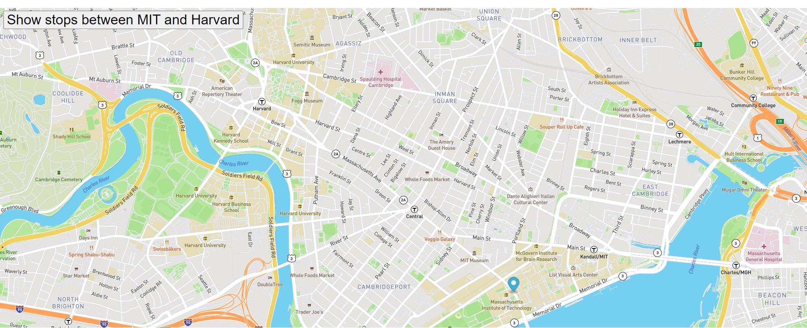

# Real-Time Bus Tracker

Description of the project:
This project was completed as part of the  MIT Fullstack Development Bootcamp course. This project tracks the route between MIT and Harvard campus. It is build using the Mapbox GL JS api. 

How to Run:
    Create an account in account.mapbox.com to get you own token.
    Clone this repository.
    Update the index.html file with your token.
    Run the index.html file in the browser.

Roadmap of future improvements: 
  Add bus icons on every stops.
  Add popups to the bus icons to give some more details of the route.

License information:
Standard GitHub MIT license
